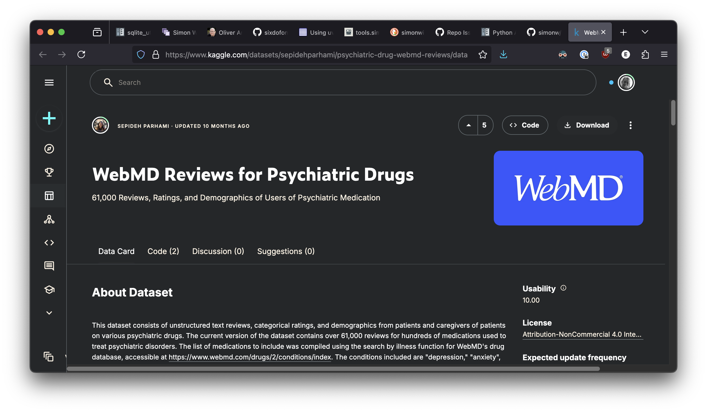

autoscale: true
theme: next, 1
code-language: Python

## AI In Healthcare, Homework 5: Self-Learning Tutorial
### [Evan Jones](mailto:evan_jones@utexas.edu), UT ID:  `ej8387`

---

# 1: Project Overview & Motivation
<a name="project_overview"/>

This guide is in five parts:
1. [Overview & Motivation](#project_overview)
2. [Project Setup](#project_setup)
3. [Dataset Ingestion](#dataset_ingestion)
4. [LLM Summarization](#llm_summarization)
5. [Final Presentation](#final_presentation)

---

# Side Effects Can Ruin Your Life
In 2002, my friend David MacLean woke up in a train station in Hydrabad, India.

He didn't know why he was there.

He didn't know his own name.

His entire past had disappeared.

---

# Loss and recovery

A kind policeman helped him find his home. 
He discovered that he was American,  on a Fulbright scholarship to study in India. 
And he discovered that he'd been taking [Lariam (Mefloquine)](https://en.wikipedia.org/wiki/Mefloquine), 
an antimalarial medication recommended by the  U.S. Government. 

Eventually, he discovered that Lariam was linked to murders, suicides, and amnesia
like his own. He told his story on the national radio program, [This American Life](https://www.thisamericanlife.org/399/contents-unknown/act-three), and wrote a book, [The Answer to the Riddle is Me](https://en.wikipedia.org/wiki/The_Answer_to_the_Riddle_Is_Me). He slowly pieced his life together.


^ David's This American Life segment won awards. It's really worth listening to!

---

# Identifying Long-tail Side Effects with LLMs

Side effects like David's are rare. 
But when many people take a medication, even "rare" side effects happen quite often. 

Small text warnings on a drug label can't prepare you for the impact a medicine might have on your life.

This project uses Large Language Models (LLMs) to summarize patient reviews for psychoactive medications and highlight outlier experiences, good or bad.


--- 

# 2: Project Setup
<a name="project_setup"/>

- Install UV
  
```shell
curl -LsSf https://astral.sh/uv/install.sh | sh
```

- Clone project

```shell
git clone https://github.com/etjones/aihc_hw5_self_learning_tutorial_ej8387.git
```

- Request an API Key for your LLM
- [Optional] Configure `llm` for alternate models
- Run program

```shell
export OPENAI_API_KEY=<YOUR_OPENAI_API_KEY>; uv run summarize_webmd_drug_reviews.py
```

^ Astral's `uv` package manager is the best thing to happen to Python packaging 
in years. Normally we'd have to install Python, set up a virtual environment, 
install dependencies, and activate the environment to use this code. Among many 
other things, `uv` just handles this.

--- 

# Request an API Key for your LLM 

[DeepSeek](https://chat.deepseek.com/), [OpenAI ChatGPT](https://chatgpt.com/), and [Claude](https://claude.ai/new) are capable, affordable, LLMs. You may need to set up accounts and credit cards for billing first.

[DeepSeek API Keys Page](https://platform.deepseek.com/api_keys)
[OpenAI API Keys Page](https://platform.openai.com/settings/organization/api-keys)
[Anthropic API Keys Page](https://console.anthropic.com/settings/keys)

**LLM API Costs, 2025-03-15**

| LLM | Input cost, 1M tokens | Output cost, 1M tokens | Max Context Window, tokens
| -------- | -------- | -------- | -------- |
| [DeepSeek-Chat](https://api-docs.deepseek.com/quick_start/pricing/)   | $0.07   | $1.10   | 64K
| [OpenAI GPT-4o Mini](https://openai.com/api/pricing/) | $0.15 | $0.60 | 128K
| [Anthropic Haiku 3.5](https://www.anthropic.com/pricing#anthropic-api)   | $0.80    | $4.00    | 200K


^ The code in this repository defaults to OpenAI `gpt-4o-mini`, so you'd need to
change the model_name in the `main()` function and configure API keys for other
models, but these are minimal changes. Knock yourself out, but for simplicity I've
just covered the OpenAI model in this tutorial.

--- 

# [Optional] Configure `llm` for alternate models

`llm` has several [mechanisms](https://llm.datasette.io/en/stable/setup.html#api-key-management) to manage API keys. You can set and forget by running:

```shell
# (Installs an llm plugin to use Anthropic models)
llm install llm-anthropic
# (Prompts for your API key and stores it persistently)
llm set keys anthropic
```
 or

```shell
llm install llm-deepseek
llm set keys deepseek
```

---

# 3. Dataset Ingestion & Database Creation
<a name="dataset_ingestion"/>

---

# Dataset Source

Shruti Narayanan's earlier project highlighted a dataset of 61,000 reviews of psychiatric drugs from WebMD.com<br>

I've included the zipped dataset, but more information is available at the source:<br>

[https://www.kaggle.com/datasets/sepidehparhami/psychiatric-drug-webmd-reviews/data](https://www.kaggle.com/datasets/sepidehparhami/psychiatric-drug-webmd-reviews/data)



---

# From Dataset To Database

[Simon Willison's](https://simonwillison.net/) [`sqlite_utils`](https://sqlite-utils.datasette.io/en/stable/) makes using local SQLite databases a breeze. 

`pandas` ingests the dataset, and `sqlite_utils` makes a working, persistent database in just a few lines


^ I can't really say enough good things about `sqlite_utils`. You end up with 
the full power and reliability of a SQL database, but creating tables or making
simple queries is really trivial. 

^ Like the best software, it makes "Easy Things Easy and Hard Things Possible"

--- 

# 4. LLM Summarization
<a name="llm_summarization"/>
People are bad at reading text and noticing the important parts. <br><br>

Fortunately, LLMs are really good at this! <br><br>

(Much better than traditional NLP approaches-- and easier too)


^It's hard to read through hundreds of thousands of reviews and pick out all the important parts without overlooking anything that could make a difference for someone. 

^Fortunately LLMs are really good at this. They're simpler to use than traditional NLP
approaches, and much better at noticing things we might care about. 

^For example, "Sentiment analysis" requires a certain amount of work to set up, 
and at the end can mostly tell you whether a message is generally positive or negative.
LLMs will notice important pieces (like life-impacting side effects!) and surface
them for us.

---

# `llm` For The Win

[Simon Willison's](https://simonwillison.net/) [`llm`](https://llm.datasette.io/en/stable/) package simplifies interacting with LLMs from Python or the command line. 
<br>
Basic use is as simple as:

```python
import llm
model = llm.get_model() # defaults to OpenAI's gpt-4o-mini
response_text = model.prompt("Summarize these reviews: ...")
```

--- 

# The Crucial Prompt

LLMs are good at paying attention to things. <br>

But we have to tell them what to prioritize, and what format we'd like returned. <br>

Extra effort in specifying a prompt is usually rewarded.


---

# Plumbing and minding details

We submit reviews for 200+ drugs. <br>

For some drugs, we have more reviews than fit into a model's context window. <br>

And we want to cache responses to avoid repeated prompting. <br>

^ There's a certain amount of complexity in making robust requests, but this function
is the top-level overview of how we do our fetching.

^ We fetch summaries drug by drug. We cache results when we get them, so that 
we don't have to make the same requests again and again while debugging or editing.

^ And for drugs that have so many reviews that they won't fit in a model's context 
window, we break up the reviews into appropriate-sized groups, and then ask
the LLM to combine the final summaries. 

^See `submit_drug_review_and_join()` for the details there.


---

# 5. Final Presentation
<a name="final_presentation"/>
Once we've created all our LLM summaries, we're left with a dictionary of 

`{drug_name: drug_summary_markdown}` pairs. 

Let's improve the presentation!

--- 

# Create a minimal Web app
I'm not much of a web programmer, but Claude is. I used the following prompt
to make a function that makes a passable-looking, vanilla HTML web app:

```text
Make a function that accepts a dict of {drug_name: markdown_summary} pairs and 
writes a directory called summary_webapp that contains a plain vanilla html page 
for each drug_name, renders the markdown_summary (which is in markdown) to HTML. 
There should also be an index.html page that contains an introduction, and all 
pages should have a menu column on the left side linking to each drug_name page. 
Let's not duplicate the menu on each page-- we should be able to use one menu 
list throughout the entire app. We should also include CSS that applies to the 
entire web app and defaults to sans-serif yellow-ish text on a darker blue 
background-- but make sure the color palettes are appealing and use web standards
```

The result was about 200 lines of code, `create_summary_webapp()` and worked
on the first try.


---

# Run It Yourself

If you've cloned the repository, installed `uv`, and set up an LLM account, you're ready to go.

Run this program to summarize our dataset reviews:

```shell
export OPENAI_API_KEY=<YOUR_OPENAI_API_KEY>; uv run ./summarize_webmd_drug_reviews.py
```

View the web app at `summary_webapp/index.html`:

```shell
# (MacOS)
open summary_webapp.index.html
```


^ Note that if you use another LLM model, you'd need to change the API Key to 
an appropriate value, like `ANTHROPIC_API_KEY` or `DEEPSEEK_API_KEY`. (And change 
the `model_name` variable in the `main()` function)
